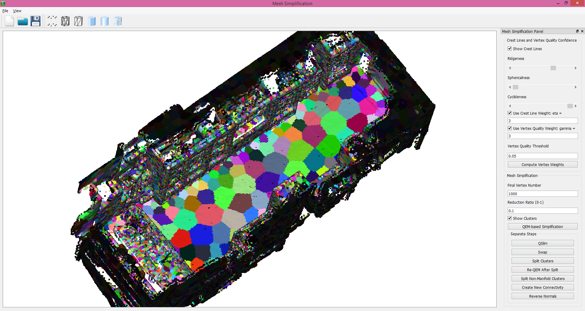

# Mesh Simplification Pipeline
This project is about simplifying a dense, coarse and noisy triangular mesh model while preserving its important features such as places with high curvatures (ridges and ravines). One typical input model is a 3D mesh reconstructed from RGB-D data scanned on a real scene by a consumer depth camera such as Kinect. The output mesh usually contains only 1% or lower number of faces of input mesh. This is done during my internship in [Paracosm](paracosm.io) in Spring 2014.

Refer to the [manual file](Meshmorizer_Manual.pdf) for details about the usage.

An example of clusters in simplification:

Wireframe of final simplified mesh:

